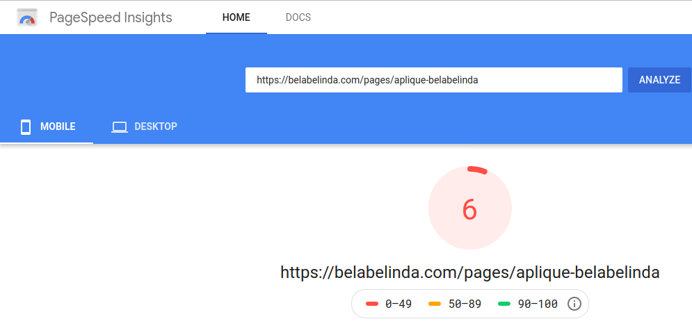
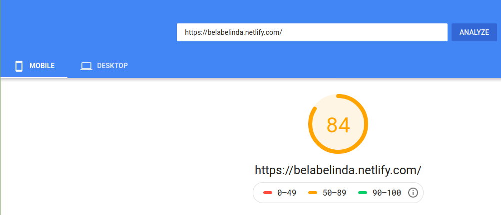

</img>
<h1 align="center">BelaBelinda</h1>

Projeto de criação de uma <strong>LANDING PAGE </strong> para a empresa BelaBelinda

## Descrição
A Bela Belinda, maior empresa do segmento APLIQUES no Brasil, está com problemas no carregamento de suas landing pages que trazem usuários para os seus sites. Atualmente a página deles, [BelaBelinda](https://belabelinda.com/pages/aplique-belabelinda ), conta com um carregamento bem abaixo para os padrões da empresa.

## Solução
Desenvolvemos uma versão nova da landingpage usando Gatsby, segue abaixo algumas informações sobre as melhorias.

> Informações tiradas do site [PageSpeedInsights](https://developers.google.com/speed/pagespeed/insights/) > - By Google

- A nota da página subiu de **6** para **84** pontos.
- O tempo que o primeiro conteúdo é pintado na tela caiu de **7.5s** para **3.1s**.
- O índice de velocidade foi de **16.9s** de lentidão para **3.1s**.
- O tempo que a página leva para ficar completamente interativa caiu de **37.3s** para **4.4s**. 

Segue abaixo prints comparativos da página que não foi feita com Gatsby e a que foi feita:

PageSpeedTest WordpressLike                              |  PageSpeedTest Gatsby
:-------------------------------------------------------:|:----------------------------------------------------:
   |  

###LINKS
[PageSpeedTest WordpressLike](https://developers.google.com/speed/pagespeed/insights/?url=https%3A%2F%2Fbelabelinda.com%2Fpages%2Faplique-belabelinda)
[PageSpeedTest Gatsby](https://developers.google.com/speed/pagespeed/insights/?url=https%3A%2F%2Fbelabelinda.netlify.com%2F)

